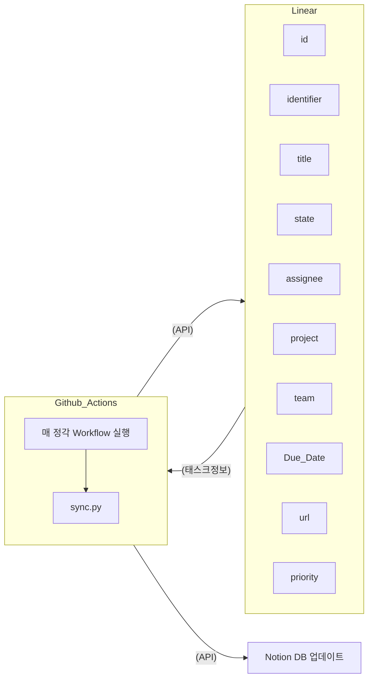

### 1. 개 요

- 기존 리니어, 노션에서는 전사적인 프로젝트 / 태스크 타임라인 확인이 어려웠음
- 이를 해결하기 위하여 리니어 - 노션 API 를 이용하여 통합 기능을 구축, 전사적 프로젝트 / 태스크 타임라인을 관리할 수 있도록 함

### 2. 운영 환경

- Github Actions를 활용한 Linear-Notion 자동 통합
- Flow chart

  1. Gtihub Actions 에서 매 정각마다 sync.py 실행
  2. Linear API를 통해 1시간 간격으로 업데이트된 각 태스크 별 정보 조회
  3. sync.py에서 이슈 별 정보를 Notion API에 매칭하여 Notion DB 업데이트 진행
